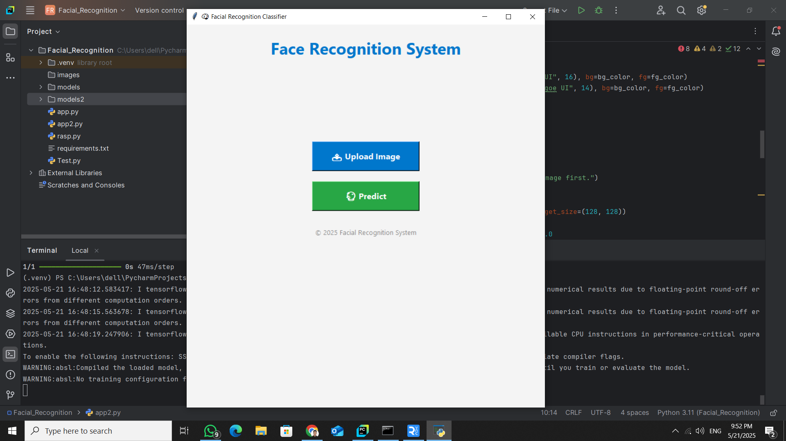
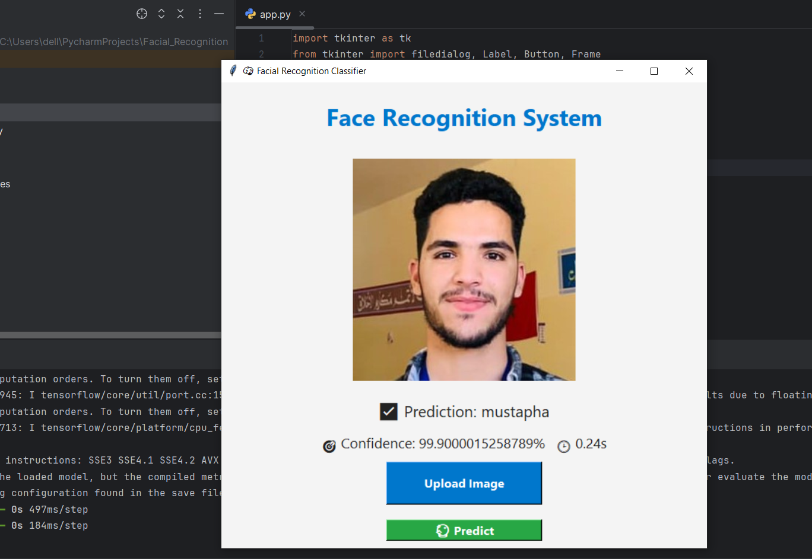
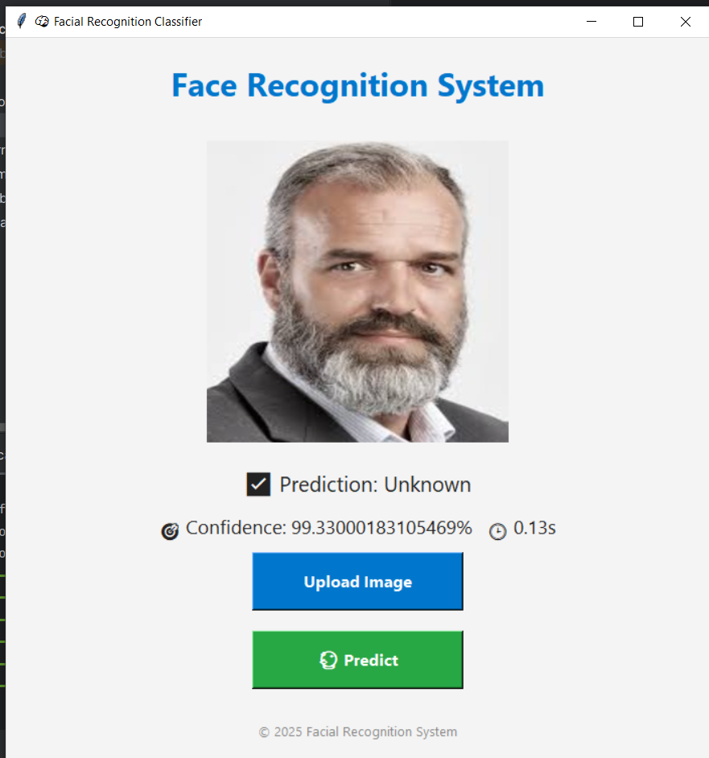

# 🧠 Facial Recognition System

## 📌 Introduction

This project presents a **real-time facial recognition system** that uses a deep learning model to identify individuals through a user-friendly graphical interface. It combines the power of **Tkinter GUI**, **TensorFlow models**, and **hardware integration** (like a Raspberry Pi) to perform accurate face recognition for known individuals.

Key features:
- Live prediction using a pre-trained classifier and feature extractor.
- Clean interface built with Tkinter.
- Real-time feedback including confidence score and prediction time.
- Easy image uploading and classification process.
- Hardware integration for physical security or identification tasks.

---

## 🔧 Hardware Setup

The facial recognition system can be integrated with a physical prototype using microcontrollers and peripherals such as:
- Raspberry Pi (or equivalent)
- Camera module
- LEDs or servos (optional for response)
- Breadboard and jumper wires

### 📸 Hardware View

---

## 🎬 Demo

A video demonstration of the working system is included to show:
- How the GUI behaves during runtime.
- Real-time face recognition in action.
- Hardware response, if connected.

### ▶️ Watch the Demo

> **Note**: To watch the full demo, open the file `Demo/demo.mp4` using a media player like VLC.

---

## 🖼 Interface Screenshots

Here are some screenshots of the GUI in action:

| Interface | Match Example | Unknown Example |
|----------|----------------|-----------------|
|  |  |  |

---

## 📁 Project Structure

📦 Project
┣ 📂 Demo
┃ ┣ 📷 hardware.png
┃ ┣ 📼 demo.mp4
┃ ┣ 🖼 interface1.png
┃ ┣ 🖼 mustapha.png
┃ ┣ 🖼 Unknown.png
┃ ┗ 🖼 raspi_mustapha.png
┣ 📂 models #too large to include
┃ ┣ face_recognition_model.h5
┃ ┣ feature_extractor.h5
┃ ┗ class_names.txt
┣ 📄 app.py
┗ 📄 README.md
